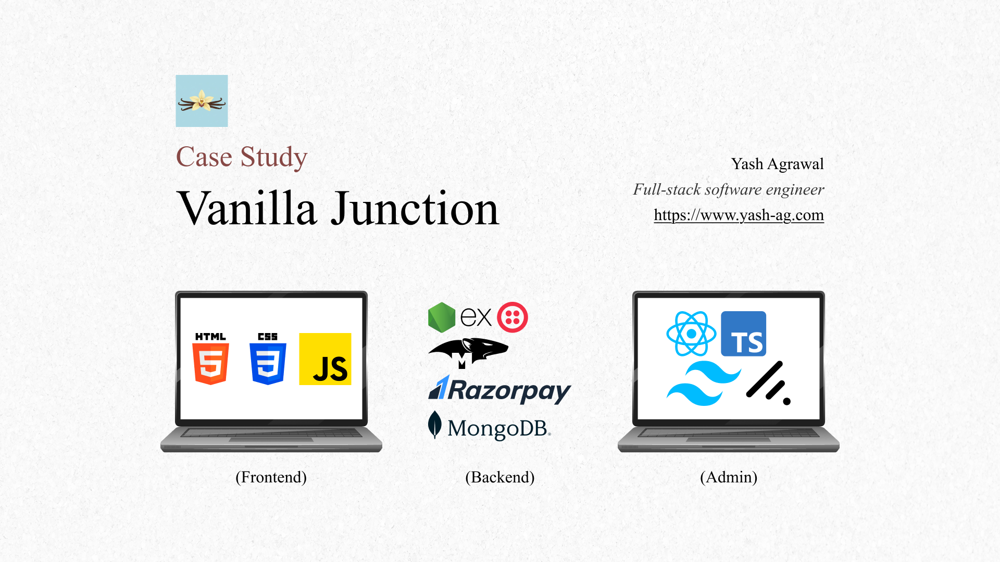

# Vanilla-Junction

This case study is a part of a learning journey for full-stack software
development using MERN Stack, and this case study is divided into 4 phases:

1. **Phase 1** - Designing UML diagrams to properly **map out** the system and
   **define** goals.
2. **Phase 2** – Development of the frontend using only HTML, CSS, and
   JavaScript. without using any third-party libraries or frameworks.
3. **Phase 3** – Development of the backend using Node.js, Express.js, and
   MongoDB, with secure integration into the frontend, along with implementing
   dummy Razorpay integration and using Twilio for sending OTP SMS.
4. **Phase 4** – Development of an admin panel using React (Vite), TailwindCSS,
   ShadCN, TypeScript and securely connecting it with the backend.

## Problem Statement

Vanilla Junction _(dummy shop)_ is a famous vanilla ice cream shop in Vadodara
and now wants to start delivery within selected pin-codes only. For this, they
need a website where customers can see the ice cream items, place their orders,
pay online, and choose a delivery address only from the selected pincodes.

_**Note** – In this entire project, AI is only allowed for writing this case
study or for non-primary tasks such as generating images of ice cream items,
fixing english, etc._

## Requirements

1. A website to display ice cream items, allow customers to place orders and
   make online payments. The website should also support optional user
   authentication using mobile number and otp so customers can log in to view
   past orders and track delivery status.
2. Dummy razorpay integration for **simulated secure online payments**.
3. Send OTP SMS using Twilio.
4. Secure backend with REST APIs and database integration.
5. Admin panel to manage the online store, including admin users, ice cream
   items, customer orders, and delivery status.
